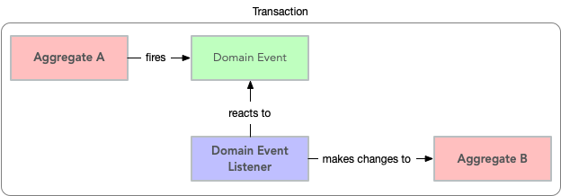
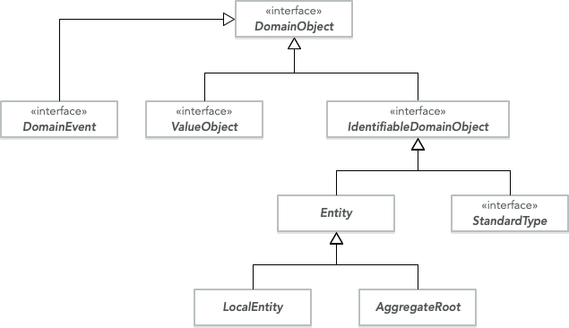

= Tactical Domain-Driven Design

:title: Tactical Domain-Driven Design
:type: text
:tags: domain-driven design, ddd, java
:description: Learn about the building blocks of tactical domain-driven design and how you can use them to design and implement a rich domain model for your project.
:repo:
:linkattrs:
:imagesdir: ./images

In this article, we are going to learn about tactical domain-driven design. Tactical DDD is a set of design patterns and building blocks that you can use to design domain-driven systems. Even for projects that are not domain-driven, you can benefit from using some of the tactical DDD patterns.

Compared to strategic domain-driven design, tactical design is much more hands-on and closer to the actual code. Strategic design deals with abstract wholes whereas tactical design deals with classes and modules. The purpose of tactical design is to refine the domain model to a stage where it can be converted into working code.

Design is an iterative process and so it makes sense to combine strategic and tactical design. You start with strategic design, followed by tactical design. The biggest domain model design revelations and breakthroughs will likely happen during tactical design and this, in turn, can affect the strategic design and so you repeat the process.

Again, the content is very much based on the books *Domain-Driven Design: Tackling Complexity in the Heart of Software* by Eric Evans and *Implementing Domain-Driven Design* by *Vaughn Vernon* and I highly recommend you to read both of them. Like in the previous article, I have chosen to explain as much as possible in my own words, injecting my own ideas, thoughts, and experiences where appropriate.

With this short introduction, it is time to bring out the tactical DDD toolbox and have a look at what is inside.

== Value Objects

One of the most important concepts in tactical DDD is the *value object*. This is also the DDD building block that I use the most in non-DDD projects, and I hope that after reading this, you will too.

A value object is an object whose value is of importance. This means that two value objects with the exact same value can be considered the same value object and are thus interchangeable. For this reason, value objects should always be made _immutable_. Instead of changing the state of the value object, you replace it with a new instance. For complex value objects, consider using the _builder_ or _essence_ pattern.

Value objects are not only containers of data - they can also contain business logic. The fact that the value objects are also immutable makes the business operations both thread-safe and side-effect free. This is one of the reasons I like value objects so much and why you should try to model as many of your domain concepts as possible as value objects. Also, try to make the value objects as small and as coherent as possible - this makes them easier to maintain and reuse.

A good starting point for making value objects is to take all single-value properties that have a business meaning and wrapping them as value objects. For example:

* Instead of using a `BigDecimal` for monetary values, use a `Money` value object that wraps a `BigDecimal`. If you are dealing with more than one currency, you may want to create a `Currency` value object as well and make your `Money` object wrap a `BigDecimal`-`Currency` pair.
* Instead of using strings for phone numbers and e-mail addresses, use `PhoneNumber` and `EmailAddress` value objects that wrap strings.

Using value objects like this have several advantages. First of all, they bring context to the value. You do not need to know whether a specific string contains a phone number, an e-mail address, a first name or a postal code, nor do you need to know whether a `BigDecimal` is a monetary value, a percentage or something completely different. The type itself will immediately tell you what you are dealing with.

Secondly, you can add all the business operations that can be performed on values of a particular type to the value object itself. For example, a `Money` object can contain operations for adding and subtracting sums of money or calculating percentages, while ensuring that the precision of the underlying `BigDecimal` is always correct and that all `Money` objects involved in the operation have the same currency.

Thirdly, you can be sure that the value object always contains a valid value. For example, you can validate the e-mail address input string in the constructor of your `EmailAddress` value object.

=== Code Examples

A `Money` value object in Java could look something like this (the code is untested and some method implementations have been omitted for clarity):

.Money.java
[source,java]
----
public class Money implements Serializable, Comparable<Money> {
    private final BigDecimal amount;
    private final Currency currency; // Currency is an enum or another value object

    public Money(BigDecimal amount, Currency currency) {
        this.currency = Objects.requireNonNull(currency);
        this.amount = Objects.requireNonNull(amount).setScale(currency.getScale(), currency.getRoundingMode());
    }

    public Money add(Money other) {
        assertSameCurrency(other);
        return new Money(amount.add(other.amount), currency);
    } 

    public Money subtract(Money other) {
        assertSameCurrency(other);
        return new Money(amount.subtract(other.amount), currency);
    }

    private void assertSameCurrency(Money other) {
        if (!other.currency.equals(this.currency)) {
            throw new IllegalArgumentException("Money objects must have the same currency");
        }
    }

    public boolean equals(Object o) {
        // Check that the currency and amount are the same
    }

    public int hashCode() {
        // Calculate hash code based on currency and amount
    }

    public int compareTo(Money other) {
        // Compare based on currency and amount
    }
}
----

A `StreetAddress` value object and corresponding builder in Java could look something like this (the code is untested and some method implementations have been omitted for clarity):

.StreetAddress.java
[source,java]
----
public class StreetAddress implements Serializable, Comparable<StreetAddress> {
    private final String streetAddress;
    private final PostalCode postalCode; // PostalCode is another value object
    private final String city; 
    private final Country country; // Country is an enum

    public StreetAddress(String streetAddress, PostalCode postalCode, String city, Country country) {
        // Verify that required parameters are not null
        // Assign the parameter values to their corresponding fields
    }

    // Getters and possible business logic methods omitted

    public boolean equals(Object o) {
        // Check that the fields are equal
    }    

    public int hashCode() {
        // Calculate hash code based on all fields
    }

    public int compareTo(StreetAddress other) {
        // Compare however you want
    }

    public static class Builder {

        private String streetAddress;
        private PostalCode postalCode;
        private String city;
        private Country country;

        public Builder() { // For creating new StreetAddresses
        }

        public Builder(StreetAddress original) { // For "modifying" existing StreetAddresses
            streetAddress = original.streetAddress;
            postalCode = original.postalCode;
            city = original.city;
            country = original.country;
        }

        public Builder withStreetAddress(String streetAddress) {
            this.streetAddress = streetAddress;
            return this;
        }

        // The rest of the 'with...' methods omitted

        public StreetAddress build() {
            return new StreetAddress(streetAddress, postalCode, city, country);
        }
    }
}
----

== Entities

The second important concept in tactical DDD and the sibling to value objects is the *entity*. An entity is an object whose _identity_ is of importance. To be able to determine the identity of an entity, every entity has a unique _ID_ that is assigned when the entity is created and remains unchanged throughout the lifespan of the entity.

Two entities of the same type and with the same ID are considered the same entity even if all other properties differ. Likewise, two entities of the same type and with the same properties but different IDs are considered different entities, just like two individuals with the same name are not considered the same.

As opposed to value objects, entities are mutable. However, that does not mean you should create setter methods for every property. Try to model all state altering operations as verbs that correspond to business operations. A setter will only tell you what property you are changing but not why. For example: let's say you have an `EmploymentContract` entity and it has an `endDate` property. Employment contracts may end because they were only temporary, to begin with, because of an internal transfer from one company branch to another, because the employee resigned or because the employer fired the employee. In all of these cases, the `endDate` is altered but for very different reasons. In addition, there may be other actions that needs to be taken depending on why the contract was ended. A `terminateContract(reason, finalDay)` method already tells a lot more than just a `setEndDate(finalDay)` method.

That said, setters still have their place in DDD. In the above example, there could be a private `setEndDate(..)` method that makes sure the end date is after the start date before setting it. This setter would be used by the other entity methods but not exposed to the outside world. For master- and reference data and for properties that describe an entity without altering its business state, it makes more sense to use setters than to try to tweak the operations into verbs. A method called `setDescription(..)` is arguably more readable than `describe(..)`.

I am going to illustrate this with yet another example. Let us say you have a `Person` entity that represents, well, a person. The person has a `firstName` and a `lastName` property. Now, if this was just a simple address book, you would let the user change this information as needed and you could use the setters `setFirstName(..)` and `setLastName(..)`. However, if you are building an official government register of citizens, changing a name is more involved. You could end up with something like `changeName(firstName, lastName, reason, effectiveAsOfDate)`. Again, context is everything.

.A Note on Getters
****
Getter methods where introduced into Java as a part of the JavaBean specification. This specification was not present in the first version of Java, which is why you can find some methods that do not conform to it in the standard Java API (for example `String.length()` as opposed to `String.getLength()`).

For me personally, I would like to see support for real properties in Java. Even though they could be using getters and setters behind the scenes, I would like to access a property value in the same way as if it was just an ordinary field: `mycontact.phoneNumber`. We cannot do that in Java yet, but we can get pretty close by leaving out the `get` suffix from our getters. In my opinion, this makes the code more fluent, especially if you need to go deeper into an object hierarchy to fetch something: `mycontact.address().streetNumber()`.

However, there is also a downside of getting rid of the getters, and that is tooling support. All Java IDEs and many libraries rely on the JavaBean standard which means you may end up manually writing code that could have been auto-generated for you and adding annotations that could have been avoided by sticking to the conventions.
****

=== Entity or Value Object?

Is not always easy to know whether to model something as a value object or as an entity. The exact same real-world concept can be modeled as an entity in one context and as a value object in another. Let us take the street address as an example.

If you are building an invoice system, the street address is just something you print on the invoice. It does not matter what object instance is used as long as the text on the invoice is correct. In this case, the street address is a value object.

If you are building a system for a public utility, you need to know exactly what gas line or what electricity line goes into a given apartment. In this case, the street address is an entity and it may even be split up into smaller entities like building or apartment. 

Value objects are easier to work with because they are immutable and small. Therefore, you should aim for a design with few entities and many value objects.

=== Code Examples

A `Person` entity in Java could look something like this (the code is untested and some method implementations have been omitted for clarity):

.Person.java
[source,java]
----
public class Person {

    private final PersonId personId;
    private final EventLog changeLog;

    private PersonName name;
    private LocalDate birthDate;
    private StreetAddress address;
    private EmailAddress email;
    private PhoneNumber phoneNumber;

    public Person(PersonId personId, PersonName name) {
        this.personId = Objects.requireNonNull(personId);
        this.changeLog = new EventLog();
        changeName(name, "initial name");
    }

    public void changeName(PersonName name, String reason) {
        Objects.requireNonNull(name);
        this.name = name;
        this.changeLog.register(new NameChangeEvent(name), reason);
    }

    public Stream<PersonName> getNameHistory() {
        return this.changeLog.eventsOfType(NameChangeEvent.class).map(NameChangeEvent::getNewName);
    }

    // Other getters omitted

    public boolean equals(Object o) {
        if (o == this) {
            return true;
        }
        if (o == null || o.getClass() != getClass()) {
            return false;
        }
        return personId.equals(((Person) o).personId);
    }

    public int hashCode() {
        return personId.hashCode();
    }
}
----

Some things to note in this example:

* A value object - `PersonId` - is used for the entity ID. We could have used a UUID, a string or a long as well but a value object immediately tells us that this is an ID that identifies a particular `Person`.
* In addition to the entity ID, this entity uses a lot of other value objects as well: `PersonName`, `LocalDate` (yes, this is also a value object even though it is part of the standard Java API), `StreetAddress`, `EmailAddress` and `PhoneNumber`.
* Instead of using a setter for changing the name, we use a business method that also stores the change in an event log, together with the reason for why the name was changed.
* There is a getter for retrieving the history of name changes.
* `equals` and `hashCode` only check the entity ID.

.Domain-Driven Design and CRUD
****
We have now come to a point where it is appropriate to address the question about DDD and CRUD. CRUD stands for *Create*, *Retrieve*, *Update* and *Delete* and is also a common UI pattern in enterprise applications:

image::crud.png[Example of a CRUD user interface]

* The main view consists of a grid, maybe with filtering and sorting, where you can look for entities (*retrieve*).
* In the main view, there is a button for creating new entities. Clicking the button brings up an empty form and when the form is submitted, the new entity shows up in the grid (*create*).
* In the main view, there is a button for editing the selected entity. Clicking the button brings up a form containing the entity data. When the form is submitted, the entity is updated with the new information (*update*).
* In the main view, there is a button for deleting the selected entity. Clicking the button deletes the entity from the grid (*delete*).

This pattern certainly has its place but should _be the exception rather than the norm_ in a domain-driven application. The reason is the following: A CRUD application is only about structuring, displaying and editing data. It normally does not support the underlying business process. When a user enters something into the system, changes something or removes something, there is a business reason behind that decision. Maybe the change is happening as a part of a larger business process? In a CRUD system, the reason for a change is lost and the business process is in the head of the user.

A true domain-driven user interface will be based on actions that are themselves part of the ubiquitous language (and thereby the domain model) and the business processes are built into the system as opposed to in the heads of the users. This, in turn, leads to a more robust, but arguably less flexible system than a pure CRUD application. I am going to illustrate this difference with a caricatural example:

Company A has a domain-driven system for managing employees whereas Company B has a CRUD-driven approach. An employee quits in both companies. The following happens:

* Company A:
  - The manager looks up the employee's record in the system.
  - The manager selects the 'Terminate Employment Contract' action.
  - The system asks for the termination date and reason.
  - The manager enters the needed information and clicks 'Terminate Contract'.
  - The system automatically updates the employee records, revokes the employee's user credentials and electronic office key and sends a notification to the payroll system.
 * Company B:
  - The manager looks up the employee's record in the system.
  - The manager puts a check in the 'Contract terminated' checkbox and enters the termination date, then clicks 'Save'.
  - The manager logs into the user management system, looks up the user's account, puts a check in the 'Disabled' checkbox and clicks 'Save'.
  - The manager logs into the office key management system, looks up the user's key, puts a check in the 'Disabled' check box and clicks 'Save'.
  - The manager sends an e-mail to the payroll department notifying them that the employee has quit.

The key takeaways are the following: Not all applications are suitable for domain-driven design, and a domain-driven application has not only a domain-driven backend but also a domain-driven user interface.

****

== Aggregates

Now when we know what entities and value objects are, we are going to look at the next important concept: *aggregates*. An aggregate is a group of entities and value objects that have certain characteristics:

* The aggregate is created, retrieved and stored _as a whole_.
* The aggregate is always in a _consistent_ state.
* The aggregate is owned by an entity called the *aggregate root*, whose ID is used to identify the aggregate itself.

image:aggregate.png[Example of an aggregate with an aggregate root]

In addition, there are two important restrictions concerning aggregates:

* An aggregate can be referenced from the outside through its root only. Objects outside of the aggregate may *not* reference any other entities inside the aggregate.
* The aggregate root is responsible for enforcing _business invariants_ inside the aggregate, ensuring that the aggregate is in a consistent state at all times.

image:aggregate_references.png[Example of allowed and prohibited references between aggregates]

This means that whenever you design an entity, you have to decide what kind of entity you are going to make: will the entity act as an aggregate root, or will it be what I call a _local entity_ that lives inside an aggregate and under the supervision of an aggregate root? Since local entities cannot be referenced from outside the aggregate, it is enough that their IDs are unique within the aggregate (they have a _local identity_), whereas aggregate roots must have globally unique IDs (they have a _global identity_). However, the importance of this semantic difference varies depending on how you choose to store the aggregate. In a relational database, it makes the most sense to use the same primary key generation mechanism for all entities. On the other hand, if the entire aggregate is saved as a single document in a document database, it makes more sense to use true local IDs for the local entities.

So how do you know if an entity is an aggregate root or not? First of all, the fact that there is a parent-child (or master-detail) relationship between two entities does not automatically turn the parent into an aggregate root and the child into a local entity. More information is needed before that decision can be made. Here is how I do it:

* How is the entity going to be accessed in the application? 
  - If the entity will be looked up by ID or through some kind of search it is probably an aggregate root.
* Will other aggregates need to reference it?
  - If the entity will be referenced from within other aggregates it is definitely an aggregate root.
* How is the entity going to be modified in the application? 
  - If it can be modified independently it is probably an aggregate root.
  - If it cannot be modified without making changes to another entity it is probably a local entity.

Once you know you are creating an aggregate root, how do you make it enforce the business invariants and what does that even mean? A business invariant is a rule that must always hold regardless of what happens to the aggregate. A simple business invariant could be that in an invoice, the total amount must always be the sum of the amounts of the line items, regardless of whether items are added, edited or removed. The invariants should be a part of the ubiquitous language and the domain model.

Technically an aggregate root can enforce business invariants in different ways:

* All state-altering operations are performed through the aggregate root.
* State-altering operations on local entities are allowed, but they notify the aggregate root whenever they change.

In some cases, for example in the example with the invoice total, the invariant could be enforced by having the aggregate root dynamically compute the total every time it is requested.

I personally design my aggregates so that invariants are enforced immediately and all the time. Arguably you could achieve the same end result by introducing strict data validation that is performed before the aggregate is saved (the Java EE way). At the end of the day, this is a matter of personal taste.

=== Aggregate Design Guidelines

When designing aggregates, there are certain guidelines to follow. I choose to call them guidelines rather than rules because there are cases when it makes sense to break them.

==== Guideline 1: Keep your aggregates small

Aggregates are always retrieved and stored as a whole. The less data you have to read and write, the better your system will perform. For the same reason, you should avoid unbounded one-to-many associations (collections) since these can grow large over time.

Having a small aggregate also makes it easier for the aggregate root to enforce the business invariants, even more so if you prefer to use value objects (immutable) instead of local entities (mutable) in your aggregates.

==== Guideline 2: Refer to other aggregates by ID

Instead of referencing another aggregate directly, create a value object that wraps the ID of the aggregate root and use that as the reference. This makes it easier to maintain aggregate consistency boundaries since you cannot even accidentally change the state of one aggregate from within another. It also prevents deep object trees from being retrieved from the data store when an aggregate is retrieved.

image:reference_by_id.png[Refer to other aggregate roots by ID]

You may need to break this guideline if you really need to access the data of the other aggregate and there is no better way of solving the problem. You could rely on the persistence framework's lazy loading capabilities, but in my experience, they tend to cause more problems than they solve. An approach that requires more coding but is more explicit is to pass in the repository (more about those later) as a method parameter:

[source,java]
----
public class Invoice extends AggregateRoot<InvoiceId> {

    private CustomerId customerId;

    // All the other methods and fields omitted

    public void copyCustomerInformationToInvoice(CustomerRepository repository) {
        Customer customer = repository.findById(customerId);
        setCustomerName(customer.getName());
        setCustomerAddress(customer.getAddress());
        // etc.
    }
}
----

In any case, you should avoid bidirectional relationships between aggregates.

==== Guideline 3: Change one aggregate per transaction

Try to design your operations so that you only make changes to one aggregate inside a single transaction. For operations that span multiple aggregates, use domain events and eventual consistency (more about this later). This prevents unintentional side effects and makes it easier to distribute the system in the future if need be. As a bonus, it also makes it easier to use document databases without transaction support.

image:aggregate_transaction.png[Modifying two aggregates in separate transactions]

However, this comes with a cost of added complexity. You need to set up an infrastructure for reliably handling domain events. Especially in a monolithic application where you can dispatch domain events synchronously within the same thread and transaction, the added complexity is in my opinion rarely motivated. A good compromise, in my opinion, is to still rely on domain events for making changes to other aggregates, but to do it inside the same transaction:

In any case, you should try to avoid changing the state of an aggregate directly from within another aggregate.

We will discuss more about this later when we cover domain events.

==== Guideline 4: Use optimistic locking

A key feature of aggregates is to enforce business invariants and ensure data consistency at all times. This is all in vain if the aggregate ends up being corrupted because of conflicting data storage updates. Therefore, you should use optimistic locking to prevent data loss when saving aggregates.

The reason optimistic locking is preferred to pessimistic locking is that it is easy to implement yourself if the persistence framework does not support it out of the box and it is easy to distribute and scale.

Sticking to the first guideline will also help in this matter since small aggregates (and thus small transactions) reduce the risk of conflicts as well.

=== Aggregates, Invariants, UI Binding and Validation

Some of you are probably now wondering how aggregates and enforcing business invariants work together with user interfaces and more specifically form binding. If invariants are to be enforced at all times and an aggregate must be in a consistent state at all times, what do you do while the user is filling out the forms? Furthermore, if there are no setters, how do you bind the form fields to your aggregates?

There are multiple ways of dealing with this one. The simplest solution is to defer invariant enforcement until the aggregate is saved, add setters for all properties and bind the entities to the form directly. I personally do not like this approach since I believe it is more data-driven than domain-driven. The risk is high that the entities degrade into anemic holders of data with the business logic ending up in a service layer (or worse, in the UI).

Instead, I prefer two other approaches. The first one is to model the forms and their contents into their own domain model concepts. In the real world, if you apply for something, you often have to fill in an application form and submit it. The application is then processed and once all the necessary information has been supplied and you meet the rules, the application is granted and you get whatever it was you applied for. You can mimic this process in the domain model. For example, if you have a `Membership` aggregate root, you could also have a `MembershipApplication` aggregate root that is used to collect all the information needed to create a `Membership`. The application object could then be used as input when creating the membership object.

The second approach is a variant of the first one and that is the _essence_ pattern. For each entity or value object you need to edit, create a mutable essence object that contains the same information. This essence object is then bound to the form. Once the essence object contains all the necessary information, it can be used to create real entities or value objects. The difference to the first approach is that the essence objects are not part of the domain model, they are just technical constructs that exist to make it easier to interact with the real domain objects. In practice, the essence pattern could look something like this:

[source,java]
----
public class Person extends AggregateRoot<PersonId> {

    private final DateOfBirth dateOfBirth;
    // Rest of the fields omitted

    public Person(String firstName, String lastName, LocalDate dateOfBirth) {
        setDateOfBirth(dateOfBirth);
        // Populate the rest of the fields
    }

    public Person(Person.Essence essence) {
        setDateOfBirth(essence.getDateOfBirth());
        // Populate the rest of the fields
    }

    private void setDateOfBirth(LocalDate dateOfBirth) {
        this.dateOfBirth = Objects.requireNonNull(dateOfBirth, "dateOfBirth must not be null");        
    }

    @Data // Lombok annotation to automatically generate getters and setters
    public static class Essence {
        private String firstName;
        private String lastName;
        private LocalDate dateOfBirth;
        private String streetAddress;
        private String postalCode;
        private String city;
        private Country country;

        public Person createPerson() {
            validate();
            return new Person(this);
        }

        private void validate() {
            // Make sure all necessary information has been entered, throw an exception if not
        }
    }
}
----

If you wanted to, you could replace the essence with a builder if you are more familiar with that pattern. The end result would be the same.

=== Code Examples

Here is an example of an aggregate root (`Order`) and a local entity (`OrderItem`) with local identity (the code is untested and some method implementations have been omitted for clarity):

.Order.java
[source,java]
----
public class Order extends AggregateRoot<OrderId> { // ID type passed in as generic parameter

    private CustomerId customer;
    private String shippingName;
    private PostalAddress shippingAddress;
    private String billingName;
    private PostalAddress billingAddress;
    private Money total;
    private Long nextFreeItemId;
    private List<OrderItem> items = new ArrayList<>();

    public Order(Customer customer) {
        super(OrderId.createRandomUnique());
        Objects.requireNonNull(customer);

        // These setters are private and make sure the passed in parameters are valid:
        setCustomer(customer.getId());
        setShippingName(customer.getName());
        setShippingAddress(customer.getAddress());
        setBillingName(customer.getName());
        setBillingAddress(customer.getAddress());
        
        nextFreeItemId = 1L;
        recalculateTotals();
    }

    public void changeShippingAddress(String name, PostalAddress address) {
        setShippingName(name);
        setShippingAddress(address);
    }

    public void changeBillingAddress(String name, PostalAddress address) {
        setBillingName(name);
        setBillingAddress(address);
    }

    private Long getNextFreeItemId() {
        return nextFreeItemId++;
    }

    void recalculateTotals() { // Package visibility to make the method accessible from OrderItem
        this.total = items.stream().map(OrderItem::getSubTotal).reduce(Money.ZERO, Money::add);
    }

    public OrderItem addItem(Product product) {
        OrderItem item = new OrderItem(getNextFreeItemId(), this);
        item.setProductId(product.getId());
        item.setDescription(product.getName());
        this.items.add(item);
        return item;
    }

    // Getters, private setters and other methods omitted
}
----

.OrderItem.java
[source,java]
----
public class OrderItem extends LocalEntity<Long> { // ID type passed in as generic parameter

    private Order order;
    private ProductId product;
    private String description;
    private int quantity;
    private Money price;
    private Money subTotal;

    OrderItem(Long id, Order order) {
        super(id);
        this.order = Objects.requireNonNull(order);
        this.quantity = 0;
        this.price = Money.ZERO;
        recalculateSubTotal();
    }

    private void recalculateSubTotal() {
        Money oldSubTotal = this.subTotal;
        this.subTotal = price.multiply(quantity);
        if (oldSubTotal != null && !oldSubTotal.equals(this.subTotal)) {
            this.order.recalculateTotals(); // Invoke aggregate root to enforce invariants
        }
    }

    public void setQuantity(int quantity) {
        if (quantity < 0) {
            throw new IllegalArgumentException("Quantity cannot be negative");
        }
        this.quantity = quantity;
        recalculateSubTotal();
    }

    public void setPrice(Money price) {
        Objects.requireNonNull(price, "price must not be null");
        this.price = price;
        recalculateSubTotal();
    }

    // Getters and other setters omitted
}
----

== Domain Events

So far we have only looked at the "things" in the domain model. However, these can only be used to describe the static state that the model is in at any given moment. In many business models, you also need to be able to describe things that happen and change the state of the model. For this, you can use *domain events*.

Domain events were not included in Evans' book about domain driven-design. They have been added to the toolbox later and are  included in Vernon's book.

A domain event is anything that happens in the domain model that may be of interest to other parts of the system. Domain events can be coarse-grained (e.g. a specific aggregate root is created or a process is started) or fine-grained (e.g. a particular attribute of a particular aggregate root is changed).

Domain events typically have the following characteristics:

* They are immutable (after all, you can't change the past).
* They have a timestamp when the event in question occurred.
* They _may_ have a unique ID that helps to distinguish one event from another. This depends on the type of event and how the events are distributed.
* They are published by aggregate roots or domain services (more about those later).

Once a domain event has been published, it can be received by one or more _domain event listeners_ that in turn may trigger additional processing and new domain events, etc. The publisher is not aware of what happens with the event, nor should the listener be able to affect the publisher (in other words, publishing domain events should be side-effect free from the point of view of the publisher). Because of this, it is recommended that *domain event listeners do not run inside the same transaction that published the event*.

From a design point of view, the biggest advantage of domain events is that they make the system extendable. You can add as many domain event listeners as you need to trigger new business logic without having to change the existing code. This naturally assumes the correct events are published in the first place. Some events you may be aware of upfront, but others will reveal themselves further down the road. You could, of course, try to guess what types of events will be needed and add them to your model, but then you also risk clogging the system with domain events that are not used anywhere. A better approach is to make it as easy as possible to publish domain events and then add the missing events when you realize you need them.

.A Note on Event Sourcing
****
Event sourcing is a design pattern where the state of a system is persisted as an ordered log of events. Each even alter the state of the system and the current state can be calculated at any time by replaying the event log from start to finish. This pattern is especially useful in applications such as financial ledgers or medical records where the history is just as important (or even more important) than the current state.

In my experience, most parts of a typical business system will not require event sourcing, but some parts do. Forcing the entire system to use event sourcing as a persistence model would, in my opinion, be overkill. However, I have found that domain events can be used to implement event sourcing where needed. In practice, this means that every operation that changes the state of the model will also publish a domain event that is stored in some event log. How to technically do this is outside the scope of this paper.
****

=== Distributing Domain Events

Domain events are only usable if you have a reliable way of distributing them to listeners. Inside a monolith, you can handle the distribution in-memory by using the standard observer pattern. However, even in this case you may need something more sophisticated if you follow the good practice of running the event publishers inside separate transactions. What if one of the event listeners fail and the event must be re-sent?

Vernon presents two different ways of distributing events that work both remotely and locally. I encourage you to read his book for the details but I am going to give a short summary of the options here.

==== Distribution Through a Message Queue

This solution requires an external messaging solution (MQ) such as AMQP or JMS. The solution needs to support the publish-subscribe model and guaranteed delivery. When a domain event is published, the producer sends it to the MQ. The domain event listeners subscribe to the MQ and will be notified immediately.

image:domain_event_mq.png[Domain event distribution through an MQ]

The advantages of this model are that it is fast, pretty easy to implement, and relies on existing tried and true messaging solutions. The disadvantages are that you have to set up and maintain the MQ solution and there is no way to receive past events if a new consumer subscribes.

==== Distribution Through an Event Log

This solution requires no additional components but requires some coding. When a domain event is published, it is appended to an event log. The domain event listeners poll this log regularly to check for new events. They also keep track of which events they have already processed to avoid having to go through the entire event log every time.

image:domain_event_log.png[Domain event distribution through an event log]

The advantages of this model are that it does not require any additional components, and it includes a complete event history that can be replayed for new event listeners. The disadvantage is that it requires some work to implement and the delay between an event being published and received by a listener is at most the polling interval.

.A Note on Eventual Consistency
****
Data consistency is always a challenge in distributed systems or where multiple data storages take part in the same logical transaction. Advanced application servers support distributed transactions that can be used to solve this problem, but they require specialized software and can be complex to configure and maintain. If _strong consistency_ is an absolute requirement, you have no choice but to use distributed transactions but in many cases, it may turn out that strong consistency actually is not that important from a business perspective. We are only used to thinking in terms of strong consistency from the times where we had a single application talking with a single database within a single ACID transaction.

The alternative to strong consistency is _eventual consistency_. This means that the data in the application will eventually become consistent, but there will be times when not all parts of the system are in sync with each other and _that is perfectly fine_. Designing an application for eventual consistency requires a different way of thinking but will, in turn, result in a system that is more resilient and more scalable than a system that requires strong consistency only.

In a domain-driven system, domain events are an excellent way of achieving eventual consistency. Any system or module that needs to update itself when something happens in another module or system can subscribe to the domain events coming from that system:

image:eventual_consistency.png[Eventual consistency through domain events]

In the example above, any changes made to System A will _eventually_ be propagated to systems B, C and D through the domain events. Each system will use its own local transaction for actually updating the data store. Depending on the event distribution mechanism and the load of the systems, the propagation time can range from less than a second (all systems are running in the same network and events are immediately pushed to subscribers) to several hours or even days (some of the systems are offline and only connect to the network occasionally to download all the domain events that have occurred since the last check-in).

In order to successfully implement eventual consistency, you have to have a reliable system for distributing domain events that work even if some of the subscribers are not currently online when an event is first published. You also need to design both your business logic and your user interface around the assumption that any piece of data can be outdated for a while at any time. You also need to draw up constraints on how long data can be inconsistent. You may be surprised to find that some pieces of data can stay inconsistent for days, whereas other pieces of data must be updated within seconds or even less.
****

=== Code Examples

Here is an example of an aggregate root (`Order`) that publishes a domain event (`OrderShipped`) when the order is shipped. A domain listener (`InvoiceCreator`) will receive the event and create a new invoice in a separate transaction. It is assumed that there is a mechanism in place that publishes all registered events when the aggregate root is saved (the code is untested and some method implementations have been omitted for clarity):

.OrderShipped.java
[source,java]
----
public class OrderShipped implements DomainEvent {
    private final OrderId order;
    private final Instant occurredOn;

    public OrderShipped(OrderId order, Instant occurredOn) {
        this.order = order;
        this.occurredOn = occurredOn;
    }

    // Getters omitted
}
----

.Order.java
[source,java]
-----
public class Order extends AggregateRoot<OrderId> {

    // Other methods omitted

    public void ship() {
        // Do some business logic
        registerEvent(new OrderShipped(this.getId(), Instant.now()));
    }
}
-----

.InvoiceCreator.java
[source,java]
----
public class InvoiceCreator {

    final OrderRepository orderRepository;
    final InvoiceRepository invoiceRepository;

    // Constructor omitted
    
    @DomainEventListener
    @Transactional
    public void onOrderShipped(OrderShipped event) {
        var order = orderRepository.find(event.getOrderId());
        var invoice = invoiceFactory.createInvoiceFor(order);
        invoiceRepository.save(invoice);
    }
}
----

== Movable and Static Objects

Before we carry on, I want to introduce you to _movable_ and _static_ objects. These are not real DDD terms but something I use myself when I think about the different parts of the domain model. In my world, a movable object is any object of which there can be more than one instance and that can be passed around between different parts of the application. Value objects, entities and domain events are all movable objects.

A static object, on the other hand, is a singleton (or a pooled resource) that always sits in one place and is invoked by other parts of the application but is rarely passed around (except when being injected into other static objects). Repositories, domain services, and factories are all static objects. 

This difference is important because it dictates what kind of relationships you can have between the objects. Static objects can hold references to other static objects and to movable objects.

Movable objects can hold references to other movable objects. However, a movable object can _never_ hold a reference to a static object. If a movable object needs to interact with a static object, the static object has to be passed in as a method parameter to the method that will interact with it. This makes the movable objects more portable and self-contained since you do not need to look up and inject any references to static objects into the movable objects every time you deserialize them.

== Other Domain Objects

When you work with domain-driven code, there will be times where you run into cases where a class does not really fit into the value object, entity or domain event mold. In my experience, this typically happens in the following cases:

* Any information from an external system (= another bounded context). The information is immutable from your point of view, but it has a global ID that is used to uniquely identify it.
* Type data that is used to describe other entities (Vaughn Vernon calls these objects *standard types*). These objects have global IDs and may even be mutable to some extent, but for all practical purposes of the application itself, they are immutable.
* Framework/infrastructure-level entities that are used to e.g. store audit entries or domain events in the database. They may or may not have global IDs and may or may not be mutable, depending on the use case.

The way I deal with these cases is to use a hierarchy of base classes and interfaces that starts with something called a `DomainObject`. A domain object is any movable object that somehow relates to the domain model. If an object is purely a value object or not purely an entity, I can declare it a domain object, explain in the JavaDocs what it does and why, and carry on.

I like to use interfaces at the top of the hierarchy since you can combine them in any way you like and even have `enums` implement them. Some of the interfaces are marker interfaces without any methods that are only used to indicate what role the implementing class plays in the domain model. In the diagram above, the classes and interfaces are the following:

* `DomainObject` - top-level marker interface for all domain objects.
* `DomainEvent` - interface for all domain events. This typically contains some metadata about the event, such as the date and time of the event, but it may be a marker interface as well.
* `ValueObject` - marker interface for all value objects. Implementations of this interface are required to be immutable and implement `equals()` and `hashCode()`. Unfortunately, there is no way of enforcing this from the interface level, even though that would be nice.
* `IdentifiableDomainObject` - interface for all domain objects that can be uniquely identified in some context. I often design this as a generic interface with the ID type as a generic parameter.
* `StandardType` - marker interface for standard types.
* `Entity` - abstract base class for entities. I often include a field for the ID and implement `equals()` and `hashCode()` accordingly. I might also add optimistic locking information to this class, depending on the persistence framework.
* `LocalEntity` - abstract base class for local entities. If I use local identity for the local entities, this class will contain code for managing that. Otherwise, it may just be an empty marker class.
* `AggregateRoot` - abstract base class for aggregate roots. If I use local identity for the local entities, this class will contain code for generating new local IDs. The class will also contain code for dispatching domain events. If optimistic locking information was not included in the `Entity` class, it is definitely included here. Audit information (created, last updated, etc.) may also be added to this class depending on the requirements of the application.

=== Code Examples

In this code example, we have two bounded contexts, *identity management* and *employee management*:

image:domain_objects_contexts.png[The *identity management* and *employee management* contexts]

The employee management context needs some, but not all, information about users from the identity management context. There is a REST endpoint for this and the data is serialized into JSON.

Inside the identity management context, a `User` is represented like this:

.User.java (identity management)
[source,java]
----
public class User extends AggregateRoot<UserId> {
    private String userName;
    private String firstName;
    private String lastName;
    private Instant validFrom;
    private Instant validTo;
    private boolean disabled;
    private Instant nextPasswordChange;
    private List<Password> passwordHistory;

    // Getters, setters and business logic omitted
}
----

Inside the employee management context, we only need the user ID and name. The user will be uniquely identified by the ID but the name is shown in the UI. We obviously cannot change any user information so the user information is immutable. The code looks like this:

.User.java (employee management)
[source,java]
----
public class User implements IdentifiableDomainObject<UserId> {
    private final UserId userId;
    private final String firstName;
    private final String lastName;

    @JsonCreator // We can deserialize the incoming JSON directly into an instance of this class.
    public User(String userId, String firstName, String lastName) {
        // Populate fields, convert incoming userId string parameter into a UserId value object instance.
    }

    public String getFullName() {
        return String.format("%s %s", firstName, lastName);
    }

    // Other getters omitted.

    public boolean equals(Object o) {
        // Check userId only
    }

    public int hashCode() {
        // Calculate based on userId only
    }
}
----

== Repositories

We have now covered all the movable objects of the domain model and it is time to move on to the static ones. The first static object is the *repository*. A repository is a persistent container of aggregates. Any aggregate that is saved into a repository can be retrieved from there at a later time, even after a system restart.

At the very least, a repository should have the following capabilities:

* Capability to save an aggregate in its entirety in some kind of data storage
* Capability to retrieve an aggregate in its entirety based on its ID
* Capability to delete an aggregate in its entirety based on its ID

In most cases, to be really usable, a repository also needs more advanced query methods.

In practice, a repository is a domain-aware interface into an external data storage such as a relational database, a NoSQL database, a directory service or even a file system. Even though the actual storage is hidden behind the repository, its storage semantics will typically leak through and impose limits on what the repository should look like. Because of this, repositories are typically either *collection-oriented* or *persistence-oriented*.

A collection oriented repository aims to mimic an in-memory collection of objects. Once an aggregate has been added to the collection, any changes made to it will be automatically persisted until the aggregate is removed from the repository. In other words, a collection oriented repository will have methods such as `add()` and `remove()` but no methods for saving.

A persistence oriented repository, on the other hand, does not try to mimic a collection. Instead, it acts as a facade for an external persistence solution and contains methods such as `insert()`, `update()` and `delete()`. Any changes made to an aggregate will have to be explicitly saved to the repository through a call to an `update()` method.

It is important to get the repository type right at the beginning of the project since they are semantically quite different. Typically, a persistence oriented repository is easier to implement and works with most existing persistence frameworks. A collection oriented repository is more difficult to implement unless the underlying persistence framework supports it out of the box.

=== Code Examples

This example demonstrates the differences between a collection oriented and a persistence oriented repository.

.Collection-oriented repository
[source,java]
----
public interface OrderRepository {

    Optional<Order> get(OrderId id);
  
    boolean contains(OrderID id);
    
    void add(Order order);
    
    void remove(Order order);
  
    Page<Order> search(OrderSpecification specification, int offset, int size);
}

// Would be used like this:

public void doSomethingWithOrder(OrderId id) {
    orderRepository.get(id).ifPresent(order -> order.doSomething());
    // Changes will be automatically persisted.
}
----

.Persistence oriented repository
[source,java]
----
public interface OrderRepository {

    Optional<Order> findById(OrderId id);

    boolean exists(OrderId id);

    Order save(Order order);

    void delete(Order order);

    Page<Order> findAll(OrderSpecification specification, int offset, int size);
}

// Would be used like this:

public void doSomethingWithOrder(OrderId id) {
    orderRepository.findById(id).ifPresent(order -> {
        order.doSomething();
        orderRepository.save(order);
    });
}
----

.A Note on CQRS
****
Repositories always save and retrieve complete aggregates. This means that they can be pretty slow, depending on how they have been implemented and the size of the object graphs that must be constructed for each aggregate. This can be problematic from a UX point of view and especially two use cases come to mind. The first one is a small listing, where you want to show a list of aggregates but only using one or two attributes. Bringing up a complete object graph when you only need a couple of attribute values is a waste of time and computing resources and often leads to a sluggish user experience. Another case is when you need to combine data from multiple aggregates in order to show a single item in a list. This may lead to even worse performance.

As long as the data sets and aggregates are small, the performance penalty may be acceptable but if the time comes where the performance is simply not acceptable there is a solution: Command Query Responsibility Segregation (CQRS).

image:cqrs.png[Command Query Responsibility Segregation]

CQRS is a pattern where you completely decouple the write (commands) and read (queries) operations from each other. Going into the details is outside the scope of this paper, but in terms of DDD, you would apply the pattern like this:

* All user operations that alter the state of the system go through the repositories in the normal fashion.
* All queries bypass the repositories and go straight to the underlying database, fetching only the data that is needed and nothing else.
* If needed, you can even design separate query objects for every view in the user interface
* The Data Transfer Objects (DTO) returned by the query objects have to include the aggregate IDs so that the correct aggregate can be retrieved from the repository when it is time to make changes to it.

In many projects, you may end up using CQRS in some views and direct repository queries in others.
****

== Domain Services

We have already mentioned that both value objects and entities can (and should) contain business logic. However, there are scenarios where a piece of logic simply does not fit into one particular value object or one particular entity. Putting business logic in the wrong place is a bad idea so we need another solution. Enter our second static object: the *domain service*.

Domain services have the following characteristics:

* They are stateless
* They are highly cohesive (meaning they are specialized in doing one thing and one thing only)
* They contain business logic that does not naturally fit elsewhere
* They can interact with other domain services and to some extent with repositories
* They can publish domain events

In its simplest form, a domain service can be a utility class with a static method in it. More advanced domain services may be implemented as singletons that have other domain services and repositories injected into them.

A domain service should not be confused with an *application service*. We are going to have a closer look at application services in the next article in this series but in short, an application service acts as the middle man between the isolated domain model and the rest of the world. The application service is responsible for handling transactions, ensuring system security, looking up the proper aggregates, invoking methods on them and saving the changes back to the database. Application services do not contain any business logic themselves.

You can summarize the difference between application and domain services as follows: a domain service is only responsible for making business decisions whereas an application service is only responsible for orchestration (finding the correct objects and invoking the correct methods in the correct order). Becasue of this, a domain service should generally not invoke any repository methods that alter the state of the database - that is the responsibility of the application service.

=== Code Examples

In this first example, we are going to create a domain service that checks whether a certain monetary transaction is allowed to proceed or not. The implementation is greatly simplified but is clearly making a business decision based on some predefined business rules.

In this case, since the business logic is so simple, you might have been able to add it directly to the `Account` class. However, as soon as more advanced business rules come into play it makes sense to move the decision making into its own class (especially if the rules change over time or depend on some external configuration). Another telltale sign that this logic may belong in a domain service is that it involves multiple aggregates (two accounts).

.TransactionValidator.java
[source,java]
----
public class TransactionValidator {

    public boolean isValid(Money amount, Account from, Account to) {
        if (!from.getCurrency().equals(amount.getCurrency())) {
            return false;
        }
        if (!to.getCurrency().equals(amount.getCurrency())) {
            return false;
        }
        if (from.getBalance().isLessThan(amount)) {
            return false;
        }
        if (amount.isGreaterThan(someThreshold)) {
            return false;
        }
        return true;
    }
}
----

In the second example, we are going to look at a domain service that has a special feature: its interface is part of the domain model but its implementation is not. This is a situation that may arise when you need information from the outside world in order to make a business decision inside your domain model, but you are not interested in where that information is coming from.

.CurrencyExchangeService.java
[source,java]
----
public interface CurrencyExchangeService {

    Money convertToCurrency(Money currentAmount, Currency desiredCurrency);
}
----

When the domain model is wired up, for example using a dependency injection framework, you can then inject the correct implementation of this interface. You could have one that invokes a local cache, another that invokes a remote web service, a third that is used for testing only and so on.

== Factories

The final static object that we are going to look like is the *factory*. As the name suggests, factories are responsible for creating new aggregates. However, this does not mean that you need to create a new factory for every aggregate. In most cases, the aggregate root's constructor will be enough to set up the aggregate so that it is in a consistent state. You will typically need a separate factory in the following cases:

* Business logic is involved in the creation of the aggregate
* The structure and content of the aggregate may be very different depending on the input data
* The input data is so extensive that the builder pattern (or something similar) is needed
* The factory is translating from one bounded context to another

A factory can be a static factory method on the aggregate root class or a separate factory class. The factory can interact with other factories, repositories and domain services but must never alter the state of the database (so no saving or deleting).

=== Code Examples

In this example, we are going to look at a factory that is translating between two bounded contexts. In the shipment context, the _customer_ is no longer referred to as a customer but as a _shipment recipient_. The customer ID is still stored so that we can relate the two concepts together later if needed.

.ShipmentRecipientFactory.java
[source,java]
----
public class ShipmentRecipientFactory {
    private final PostOfficeRepository postOfficeRepository;
    private final StreetAddressRepository streetAddressRepository; 

    // Initializing constructor omitted

    ShipmentRecipient createShipmentRecipient(Customer customer) {
        var postOffice = postOfficeRepository.findByPostalCode(customer.postalCode());
        var streetAddress = streetAddressRepository.findByPostOfficeAndName(postOffice, customer.streetAddress());
        var recipient = new ShipmentRecipient(customer.fullName(), streetAddress);
        recipient.associateWithCustomer(customer.id());
        return recipient;
    }
}
----

== Modules

It is almost time to move on to the next article but before we leave tactical domain driven design, there is one more concept we need to look at and that is *modules*. 

Modules in DDD correspond to *packages* in Java and *namespaces* in C#. A module can correspond to a bounded context, but typically, a bounded context will have multiple modules.

Classes that belong together should be grouped into the same module. However, you should not create modules based on the type of class but based on how the classes fit into the domain model from a business perspective. That is, you should *not* put all repositories into one module, all entities into another, etc. Rather, you should put all classes that relate to a particular aggregate or a particular business process into the same module. This makes it easier to navigate your code since _classes that belong together and work together also live together_.

=== Module Example

This is an example of a module structure that groups the classes by type. *Do not do this*:

* foo.bar.domain.model.*services*
    - `AuthenticationService`
    - `PasswordEncoder`
* foo.bar.domain.model.*repositories*
    - `UserRepository`
    - `RoleRepository`
* foo.bar.domain.model.*entities*
    - `User`
    - `Role`
* foo.bar.domain.model.*valueobjects*
    - `UserId`
    - `RoleId`
    - `UserName`

A better way is to group the classes by process and aggregate. *Do this instead:*

* foo.bar.domain.model.*authentication*
    - `AuthenticationService`
* foo.bar.domain.model.*user*
    - `User`
    - `UserRepository`
    - `UserId`
    - `UserName`
    - `PasswordEncoder`
* foo.bar.domain.model.*role*
    - `Role`
    - `RoleRepository`
    - `RoleId`

== Why is Tactical Domain-Driven Design Important?

Like I mentioned in the introduction to the first article in this series, I first ran into domain driven design while salvaging a project that was suffering from severe data inconsistency problems. Without any domain model or ubiquitous language, we started to transform the existing data model into aggregates and the data access objects into repositories. Thanks to the constraints that these introduced into the software, we managed to get rid of the inconsistency problems and eventually the software could be deployed into production.

This first encounter with tactical domain-driven design proved to me that you can benefit from it even if the project in all other aspects is not domain driven. My favorite DDD building block that I tend to use in all of the projects I participate in is the *value object*. It is easy to introduce and immediately makes the code easier to read and understand since it brings context to your attributes. The immutability also tends to make complex things simpler.

I often also try to group data models into aggregates and repositories even if the data model is otherwise completely anemic (only getters and setters without any business logic). This helps in keeping the data consistent and avoids strange side effects and optimistic locking exceptions when the same entity is being updated through different mechanisms.

Domain events are useful to decouple your code, but this is a double-edged sword. If you rely too much on events, your code will become more difficult to understand and debug since it is not immediately clear what other operations a particular event will trigger or what events caused a particular operation to be triggered in the first place.

Like other software design patterns, tactical domain-driven design offers solutions to a set of problems that you typically run into, especially when building enterprise software. The more tools you have at your disposal, the easier it will be for you to tackle the problems you inevitably run into in your career as a software developer.

== Next: Domain-Driven Design and the Hexagonal Architecture

In the next article in this series, we are going to learn what the hexagonal architecture is, how it plays nicely together with domain-driven design and how the outside world can interact with the domain model in a controlled and extendable manner.
