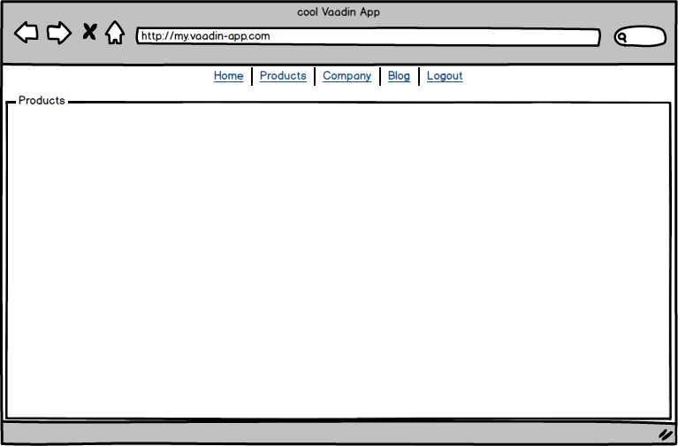

= App-Layout for Flow

:title: Business Application Layout for Vaadin Flow
:type: text
:author: Sven Ruppert
:tags: Layout, Flow, Java
:description: Learn how to work with the Vaadin Flow app-layout to create business apps.
:repo: https://github.com/vaadin-learning-center/flow-layout-app_layout-vaadin
:imagesdir: ./images

== Intro
A web application can target a wide variety of audiences.
In our case, I assume a web application that in an office fears the support of internal processes.
This web application is more akin to a widespread business application, which has probably been contacted by just about every developer.
The web interfaces in this area are quite often based on the experiences made with the classic desktop applications.

== Minimal Requirements
In our minimal version, we will assume that there will be a menu in the application header.
The number of menu entries is limited to four to five and is, therefore, no challenge for a screen.
Of course, on the assumption that the terms used are a little shorter than many other words from German, such as "Gleisschotterrbettungsreinigungsmaschine".

== The Layout
The web application is to be divided into a layout to put the frame of the application and then the following professional views.
These business views should be injected into the workspace defined in the arrangement and accessed using the menu items.
Here we have the challenge for the first time that the navigation will not only replace the entire area.
We can imagine that as follows.

Within the range "Products" shown below the menu bar, the respective views is used.

== The basic structure
The basic framework that will be used here is based on the component App-Layout by Vaadin itself.
The official description of the component is by the way available under <<app-layout>>
The Vaadin App layout is based on routing using RouterLayout.
About this, we had a little more detail in the last blog post.
What's new here is the layout itself, i.e. the arrangement of the menu bar and the work areas.
To start with Vaadin's AppLayout, we'll create a class named
**MainLayout**, extending the class **AbstractAppRouterLayout**.

[NOTE]
====
If you are using the following dependency, the component app-layout is already available in your classpath.
[source, xml]
----
    <dependency>
      <groupId>com.vaadin</groupId>
      <artifactId>vaadin</artifactId>
    </dependency>
----

If not, the corresponding **maven** dependence is

[source,java]
----
<dependency>
    <groupId>com.vaadin</groupId>
    <artifactId>vaadin-app-layout-flow</artifactId>
</dependency>
----
====

The method to be implemented has the name **configure** and provides two parameters.
The first is the instance of the generated AppLayout itself and the second is the menu used in the AppLayout.
Based on these two instances you can start with the design.
In addition to the logo placed in the upper left corner, you can of course also set up the menu items.
A menu item itself is created with an instance of class **AppLayoutMenuItem**.
Different combinations can be chosen.
For example, an icon plus a description and a navigation target can be used, or a definition of an ActionListener instead of a navigation target.

[source,java]
----
@Theme(Lumo.class)
public class MainLayout extends AbstractAppRouterLayout {

  private static final String LOGO_PNG = "logo.png";

  public static final String ITM_DASHBOARD = "mainview.menue.item.dashboard";
  public static final String ITM_PROFILE = "mainview.menue.item.profile";
  public static final String ITM_TRENDS = "mainview.menue.item.trends";
  public static final String ITM_LOGOUT = "mainview.menue.item.logout";

  @Override
  protected void configure(AppLayout appLayout ,
                           AppLayoutMenu appLayoutMenu) {

    StreamResource res = new StreamResource(LOGO_PNG ,
                                            () -> MainView.class.getResourceAsStream("/" + LOGO_PNG));
    Image img = new Image(res , "Vaadin Logo");

    img.setHeight("44px");
    appLayout.setBranding(img);

    appLayoutMenu
        .addMenuItems(
            new AppLayoutMenuItem(DASHBOARD.create() ,
                                  appLayout.getTranslation(ITM_DASHBOARD) ,
                                  DashboardView.NAV) ,
            new AppLayoutMenuItem(USER.create() ,
                                  appLayout.getTranslation(ITM_PROFILE) ,
                                  ProfileView.NAV) ,
            new AppLayoutMenuItem(TRENDING_UP.create() ,
                                  appLayout.getTranslation(ITM_TRENDS) ,
                                  TrendsView.NAV) ,
            new AppLayoutMenuItem(SIGN_OUT.create() ,
                                  appLayout.getTranslation(ITM_LOGOUT) ,
                                  e -> {
                                    UI ui = UI.getCurrent();
                                    VaadinSession session = ui.getSession();
                                    session.setAttribute(SecurityService.User.class , null);
                                    session.close();
                                    ui.navigate(MainView.class);
                                  }));
  }
}
----

[NOTE]
====
This example is using the **I18Provider** from Flow.
To read more about this I recommend our tutorials about __Internationalising in Flow__ <<i18n>>
====

To use the layout now, you have to assign the attribute **layout** with the class **MainLayout** to the participating views in the **@Route** annotation.

[source,java]
----
@Route(value = MainView.NAV_MAIN_VIEW, layout = MainLayout.class)
public class MainView extends Composite
 implements HasLogger {
  public static final String NAV_MAIN_VIEW = "main";

  public MainView() {
    getContent().add(new Span("Page content"));
  }
}
----

== Fazit
We now have a straightforward framework of an application with a structure typical of today.
The functionalities are limited, but sometimes that is quite enough.
However, if you want a little more extensive options, you can take a look around in the __VaadinDirector__ <<vdir>>.
There are other solutions.
I will take a closer look at a few other ones of them in the next parts of this series.

[bibliography]
== References
- [[[i18n]]] Vaadin Tutorials: https://vaadin.com/tutorials/i18n[How to deal with I18N]
- [[[vdir]]] Vaadin Directory: https://vaadin.com/directory/search?keyword=App&keyword=layout[App Layouts]
- [[[app-layout]]] Vaadin App-Layout: https://vaadin.com/components/vaadin-app-layout[Component documentation]

