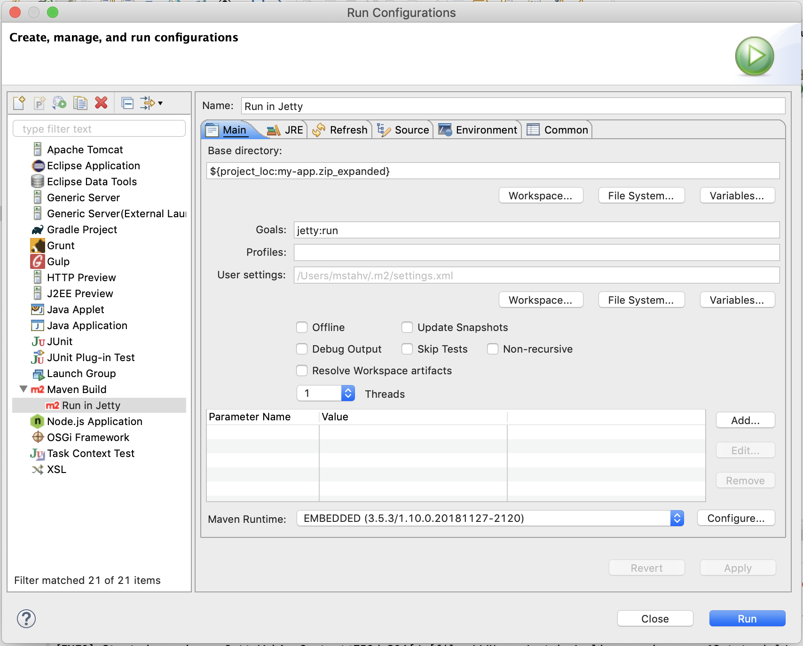

[[flow.tutorial]]
= How to Use Vaadin Flow

:title: Part 1 - How to use Vaadin Flow
:author: Vaadin
:tags: Flow, Java
:sectnums:
:imagesdir: ./images

This basic tutorial takes you through the process of creating your first web app with https://vaadin.com/flow[Vaadin Flow].

You can get up and running quickly with Vaadin Flow. You don't need extensive Java knowledge, but you do need basic Java programming skills, some experience using an https://en.wikipedia.org/wiki/Integrated_development_environment[IDE] (like Eclipse) and Maven, and JDK 8 installed on your computer.  

== Overview

In this tutorial we build a very simple customer management system to demonstrate basic Vaadin Flow development. The system has no real-world application and is for demonstration purposes only. To help you understand how to hook it to an existing Java-based backend, we use an in-memory "backend". 

The result is a single web page, consisting of a table (called a Grid in Vaadin) with filtering capabilities and functionality to add, delete and update customer data. 

//[[figure.flow.tutorial.final-ui]]
//.UI to be built in the tutorial
image:images/FinishedUI.png[UI to be built in the tutorial]

You can use the result as a starting point for more Vaadin Flow experiments, such as using add-ons, adding a custom theme, adding new views, or optimizing for mobile. 

The tutorial should take 20 - 60 minutes to complete. 

As an alternative to coding from scratch, you can 
https://github.com/vaadin/flow-and-components-documentation/tree/master/tutorial-getting-started[download the final application] and experiment with it.

=== Installing the Development Tools 

* *JDK 8*: The tutorial uses Java 8. Make sure that you have JDK 8 installed and that it is up to date.
** Most Linux distributions can use package managers to install JDK 8.
** Windows and Mac users need to download JDK 8 from http://www.oracle.com/technetwork/java/javase/downloads/index.html[Oracle's Java SE Downloads].

* *IDE*: The tutorial uses Eclipse, but you can use any IDE. Make sure you have the latest version installed. 
** To download Eclipse, select *Eclipse IDE for Java EE Developers* from the available packages at https://www.eclipse.org/downloads/packages/[eclipse.org].

=== Installing the Project Base

The tutorial uses the *Project Base* starter pack for Vaadin. 

A starter pack is a project stub that has all the dependencies set up, and may also include sample code. 

To download the starter pack:

. Open https://vaadin.com/start[Start a new project] in your browser. 

. Go to *Latest Release* > *For Java Developers* and select *Project Base*.

. In *Get Started* enter:
** *Group ID*: `com.vaadin.starter.skeleton`.

** *App Name*: `my-app`.

. Select *Download* to download the `my_app.zip` package to your file system. If the button is not active, you may need to log in.

To import the starter pack into Eclipse:

. Extract `my-app.zip` to a new `my-app` folder.

. In Eclipse, go to *File* > *Import*.

. Expand *Maven* and select *Existing Maven Project*.

. Select *Next*.

. Select *Browse* and then select the `my-app` folder.

. Select *Finish*.

To build the project in Eclipse:

. In *Project Explorer* right-click the `my-app` folder.

. Select *Run As* > *Maven install*. 

[NOTE]
*Maven install* initiates a full build of your application and creates a https://en.wikipedia.org/wiki/WAR_(file_format)[WAR] file in the `/target` directory of your project folder. You can deploy the WAR file to your application server when you go to production. During development, we use Jetty that is provided through Maven, and there is no need to install an application server. 

 
=== Viewing the Starter Files

You can view your project resources in the *Project Explorer* tree. 

Note:

* `/pom.xml` contains the settings for building your project and declares the dependencies that are used. 

* `/Java Resources/src/main/java` contains the Vaadin UI code.

** `../MainView.java` defines the application layout. 
+
[source,java]
----
/**
 * The main view contains a button and a click listener.
 */
@Route("")
public class MainView extends VerticalLayout {

    public MainView() {
        Button button = new Button("Click me",
                event -> Notification.show("Clicked!"));
        add(button);
    }
}
----

*** The [classname]`@Route("")` annotation tells Vaadin Flow to direct the root URL to this view.
*** There is a button in the main view and a notification is shown when it is clicked. 
*** The logic is attached to the button with a simple Java 8 lambda expression.
*** Finally, the button is added in the main view.

=== Testing the Application

To test your application:

. Right-click the `my-app` folder. 

. Select [guilabel]*Debug As* > *Maven build…*. 
+

. In the dialog enter:

** *Name*: `Debug in Jetty`. 
** *Goals*: `jetty:run`.

+

. Select *Debug*. 
+

. Once the server has started, open `http://localhost:8080` to see your application in the browser.

[NOTE]
If you make changes to the code, Jetty  picks up the changes and deploys most of them automatically within a few seconds. You can also reload the page to reflect the changes.

[TIP]
If your JVM does not permit injecting changes on the fly, Eclipse will show an error similar to `Hot Code Replace Failed`. Restart the server to display the latest changes. Many Java developers use http://zeroturnaround.com/software/jrebel/[JRebel] (commercial JVM agent) to ensure that hot-code replacement work smoothly.
