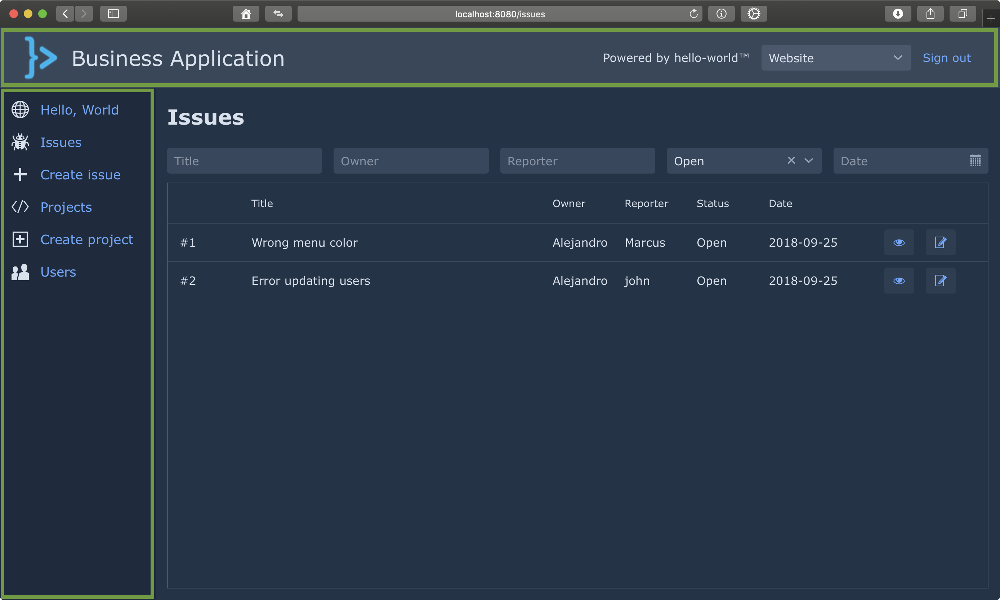
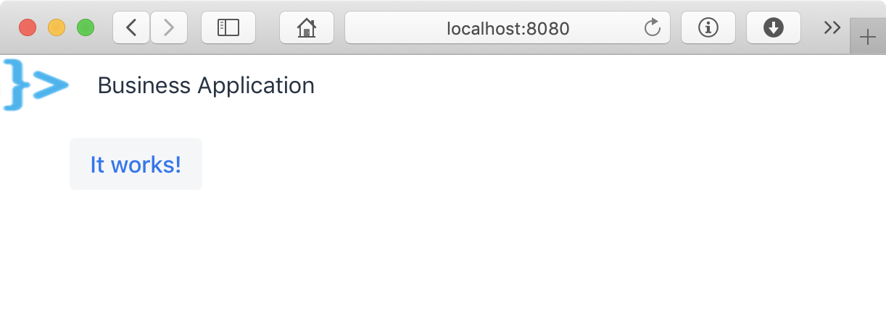
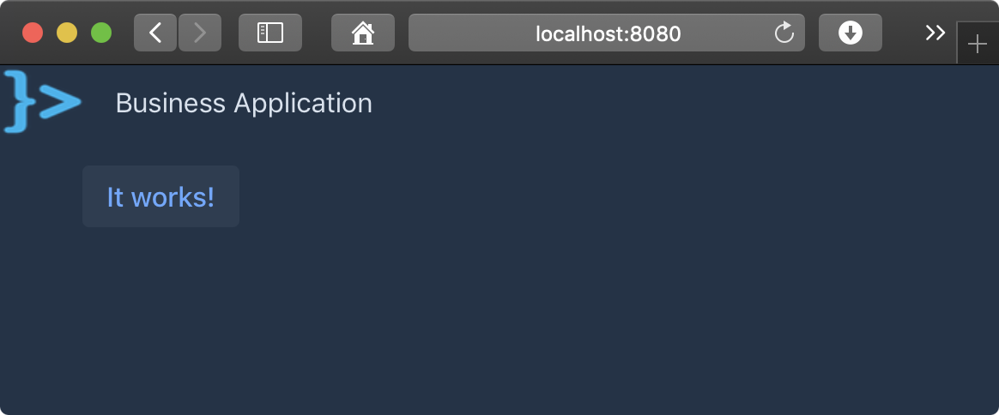
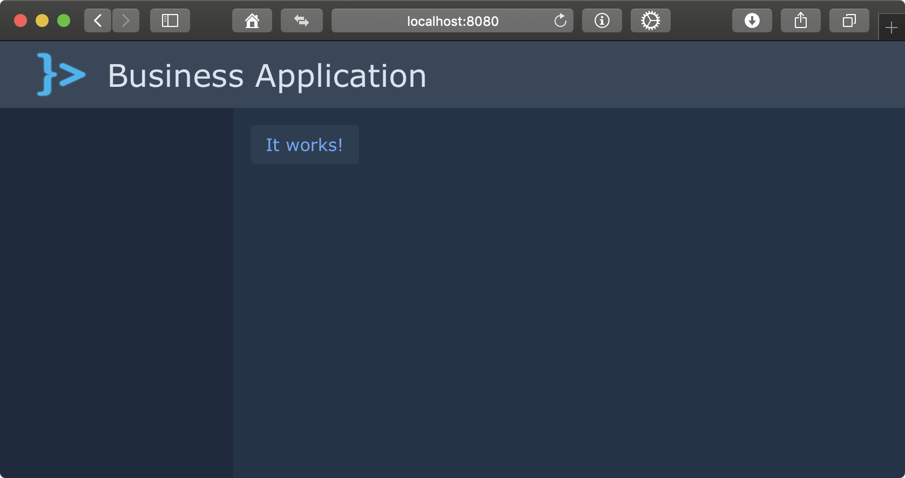

= Implementing an application's main layout

:tags: vaadin, java, spring, layout
:author: Alejandro Duarte
:publish_date: 2018-12-12 //optional, won't be shown before this
:description: Learn how to implement the main layout of a web application using Vaadin
:repo: https://github.com/vaadin-learning-center/spring-business-app
:linkattrs: // enable link attributes, like opening in a new window
:imagesdir: ./images

In this step of the tutorial, you will develop the bare-bones of the user interface for a Business Application.

== Implementing a common UI layout

As shown in the following figure, the web user interface of the example application includes a _header_ and _menu_ that are always visible:

With Vaadin Flow, you can implement this two parts of the UI in two independent classes.

=== Implementing the header

Start by creating a new class with the name `Header` inside the `com.example.common.ui` package of the `common` Maven module. Let the class extend `Composite<HorizontalLayout>`. This allows you to hide the fact that the header is a `HorizontalLayout` which is an implementation detail clients of this class shouldn't worry about:

.common/.../Header.java
[source,Java]
----
public class Header extends Composite<HorizontalLayout> {
}
----

Create a constructor and use the `Image` and `Span` components to compose the header. You can access the underlying `HorizontalLayout` instance by calling `getContent()`:

.common/.../Header.java
[source,Java]
----
...
    public Header() {
        Image logo = new Image("/frontend/images/app-logo.png", "App logo");
        Span appName = new Span("Business Application");

        getContent().add(logo, appName);
        getContent().setWidth("100%");
        getContent().setAlignSelf(FlexComponent.Alignment.CENTER, appName);
    }
...
----

Download the image file at https://github.com/alejandro-du/business-app-spring/blob/master/webapp/src/main/resources/META-INF/resources/frontend/images/app-logo.png and add it to the `src/main/resources/META-INF/resources/frontend/images` directory of the `webapp` module.

=== Implementing the main menu

Create a new class named `MainMenu` in the `com.example.common.ui` package. This time, extend `Composite<VerticalLayout>`.

.common/.../MainMenu.java
[source,Java]
----
public class MainMenu extends Composite<VerticalLayout> {
}
----

For this first iteration, it's enough to have an empty menu. You'll add the code to add options later. Here's what's enough for the implementation of the menu at this point:

.common/.../MainMenu.java
[source,Java]
----
...
    public MainMenu() {
        getContent().setSizeUndefined(); <1>
    }
...
----
<1> `setSizeUndefined()` allows the `MainMenu` to grow or shrink based on its contents.

=== Implementing the main layout

Functional modules should be able to add _views_ to the business application by creating classes annotated with `@Route`. This views, however, should use the same main layout (with the header and main menu you implemented in the previous sections) when appropriate.

Vaadin Flow has the concept of a _route layout_. The `@Route` annotation has a `layout` property that allows you to define a layout component in which the annotated class would be rendered. A _router layout_ class should implement `RouterLayout` and override the `showRouterLayoutContent(HasElement)` method.

Create a new class with the name `MainLayout` inside the `com.example.common.ui` package. Let the class extend `Composite<VerticalLayout>`, implement `RouterLayout`, and annotate it with `@UIScope`:

.common/.../MainLayout.java
[source,Java]
----
@UIScope <1>
public class MainLayout extends Composite<VerticalLayout>
        implements RouterLayout { <2>
}
----
<1> Makes instances of this class Spring-managed beans with a UI scope (one bean per UI instance).

<2> Allows view implementations to use this layout by annotating the class with `@Route(layout=MainLayout.class)`.

Views using this layout (annotated with `@Route(layout=MainLayout.class)`) are passed to the `MainLayout.showRouterLayoutContent(HasElement)` method. This method should place the view in the correct part of the layout. Create a new field instance to add the views and implement the `showRouterLayoutContent(HasElement)` method as follows:

.common/.../MainLayout.java
[source,Java]
----
@UIScope
public class MainLayout ... {

    private VerticalLayout contentLayout = new VerticalLayout(); <1>

    @Override
    public void showRouterLayoutContent(HasElement content) {
        contentLayout.removeAll(); <2>
        contentLayout.getElement().appendChild(content.getElement()); <3>
    }

}
----
<1> This component will contain the view marked later with `@Route`.

<2> Removes all the components in the `contentLayout` component in order to add the specified one (`content`).

<3> Adds the new content to the `contentLayout` component. You cannot use the `add` method of `VerticalLayout` which expects an array of ``Component``s (content is of type `HasElement`). However, you can use the _Element API_ of Vaadin Flow to achieve the same.

Now use the `contentLayout` object and the `Header` and `MainMenu` classes to compose the actual layout in the constructor. Here's the implementation:

.common/.../MainLayout.java
[source,Java]
----
...
    public MainLayout() {
        Header header = new Header();
        MainMenu mainMenu = new MainMenu();

        contentLayout.setPadding(false);
        contentLayout.setSpacing(false);

        HorizontalLayout horizontalLayout = new HorizontalLayout(mainMenu, contentLayout);
        horizontalLayout.setSizeFull();
        horizontalLayout.setPadding(false);
        horizontalLayout.setSpacing(false);

        getContent().add(header, horizontalLayout);
        getContent().setAlignSelf(FlexComponent.Alignment.CENTER, horizontalLayout);
        getContent().setSizeFull();
        getContent().setPadding(false);
        getContent().setSpacing(false);
    }
...
}
----

To use the layout, change the `@Route` annotation in the `MainView` class of the `webapp` as follows:

.webapp/.../MainView.java
[source,Java]
----
@Route(layout = MainLayout.class)
public class MainView extends VerticalLayout {
    ...
}
----

== Styling the application

If you run the application at this point you should see a very simple and far from optimal UI:

=== Using theme variants

Vaadin Flow comes with the Valo theme which in turn has two _variants_. Start by configuring the dark variant using the `@Theme` annotation in the `MainLayout` class as follows:

.common/.../MainLayout.java
[source,Java]
----
@UIScope
@Theme(value = Lumo.class, variant = Lumo.DARK)
public class MainLayout ... {
    ...
}
----

Restart the application to see the theme variant in action:

=== Styling with CSS

Create a new file called `shared-styles.html` in the `src/main/resources/META-INF/resources/frontend/styles` directory of the `webapp` module. You can use Lumo's CSS custom properties inside a `<custom-style>` element as follows:

.webapp/.../shared-styles.html
[source, html]
----
<custom-style>
    

</custom-style>
----

NOTE: Note that the previous file is an HTML file, not a CSS file. This is required when defining CSS for Web Components.

Besides using standard CSS rules, you can use Lumo's CSS custom properties to quickly customize the overall look of the application. The following snippet of code shows the CSS required to change the font of all the components in Vaadin Flow and how to style the reconnect dialog box that appears when the Vaadin Servlet seems to be unreachable:

.webapp/.../shared-styles.html
[source,css]
----
...
       html {
            --lumo-font-family: Verdana;
        }

        .v-reconnect-dialog {
            background-color: rgba(0, 0, 0, .75);
            color: var(--lumo-error-color);
        }
 ...
----

In order to make this file available to the application you have to use the `@HtmlImport` annotation in the `MainLayout` class as follows:

.webapp/.../MainLayout.java
[source,Java]
----
...
@HtmlImport("/frontend/styles/shared-styles.html")
public class MainLayout ... {
    ...
}
----

=== Styling individual components

In order to style individual elements of the UI, you have to add _CSS class names_ to the components. You do this by using the `addClassName(String)` method.

Start with the `Header` component:

.common/.../Header.java
[source,Java]
----
    ...
    public Header() {
        ...
        getContent().addClassName("header");
        logo.addClassName("header-logo");
        appName.addClassName("header-app-name");
    }
    ...
----

Similarly, add the following to the `MainMenu` component:
.common/.../MainMenu.java
[source,Java]
----
    ...
    public MainMenu() {
        ...
        getContent().addClassName("main-menu");
    }
    ...
----

Create a new file named `main-layout-styles.html` in the `src/main/resources/META-INF/resources/frontend/styles` directory of the `webapp` module and add the corresponding CSS selectors:

.webapp/.../header-styles.html
[source,html]
----
<custom-style>
    
</custom-style>
----

Make this file available to the application by using the `@HtmlImport` annotation in the `MainLayout` class as follows:

.webapp/.../MainLayout.java
[source,Java]
----
...
@HtmlImport("/frontend/styles/main-layout-styles.html")
public class MainLayout ... {
    ...
}
----

If you restart the application, you should see the new styles in action:

== What’s next?
In this step of the tutorial, you implemented a common UI layout that functional modules can use. In the next step, you’ll implement a mechanism to discover functional modules and a simple functional example module.
