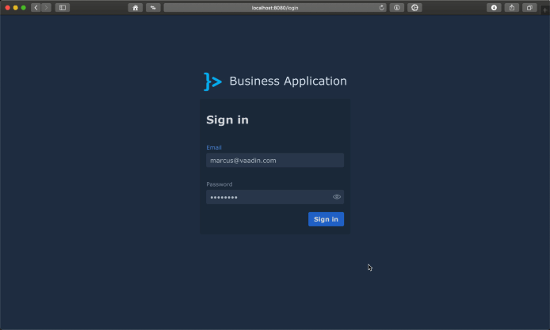
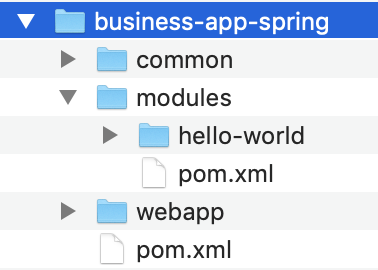
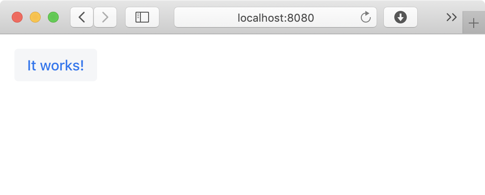

= Setting up a multi-module Maven project

:tags: vaadin, java, spring
:author: Alejandro Duarte
:publish_date: 2018-12-12 //optional, won't be shown before this
:description: Learn how to create a multi-module Maven project
:repo: https://github.com/vaadin-learning-center/spring-business-app
:linkattrs: // enable link attributes, like opening in a new window
:imagesdir: ./images

In this tutorial, you will create a modular _business application_ with a database connectivity, web user interface, authentication, and authorization. To follow the tutorial you will need the JDK version 8, Maven 3, and your favorite IDE. The main technologies you will use to implement the application are https://spring.io/projects/spring-boot[Spring Boot] and https://vaadin.com/flow[Vaadin Flow]. This combination allows you to build a web application using the Java Programming Language without having to write any HTML or JavaScript code at all.

NOTE: Note that this is an advanced tutorial. If you want to try out Vaadin or if you are starting with it, follow the tutorial at https://vaadin.com/docs/v11/flow/introduction/tutorial-get-started-first-part.html. This tutorial assumes you have some familiarity with Java 8, Vaadin Flow, and Spring Boot.

== The example application

_Business applications_ (also known as _enterprise applications_) offer services to customers or support the operations of a company. This type of applicationS frequently incorporate functionality related to accounting, financial management, content management, resource planning, customer relationship management, and supply chain management.

Since, all these categories can be implemented as independent modules, at least to some extent, this tutorial shows how to develop a business application with functional modules discovered at runtime. In order to avoid detailed explanations of functional requirements, this tutorial develops an _issue tracking system_ or _bug tracker_.

The following figure shows the application in action:

== The source code

The source code is available at https://github.com/alejandro-du/business-app-spring. The application consist of a parent Maven project called `business-app-spring` which contains three sub Maven modules:

* `*common*`: Packaged as a JAR file, this module includes everything needed by other modules. This module can be distributed to third parties who can extend the functionality of the business application by using its API to implement new _functional modules_.

* `*modules*`: The parent module for all the functional modules in the application. Frequently, a business application includes many functional modules, hence grouping them in a parent module makes the project more organized. A functional module contains most, if not all, the implementation of actual functional requirements. The example includes a `hello-world` module and a more realistic `issues` module that implements the functionality of an issue tracking system. Functional modules are packaged as JAR files.

* `*webapp*`: Packaged as an executable Spring Boot JAR file, this module contains the essentials of the web application. It uses the `common` module to detect and initialize at runtime any functional module in the classpath, giving the functional modules the opportunity to add menu options and screens to the business application. This module creates is the artifact that can be deployed to a production environment.

Bear in mind that this tutorial uses the terms _Maven module_ and _module_ as synonyms. The more specific term _functional module_ refers to a Maven module that implements functional requirements. Examples of non-functional requirements are security, logging, authentication, and authorization, while accounting, resource planning, or issue tracking are examples of functional requirements, that is, related to business areas in a company.

== Creating a multi-module Maven project

The following figure shows the directory structure and the Maven modules you’ll create in this part of the tutorial:

Start by using the `pom-root` Maven archetype to create a multi-module (or aggregator) project. This project will list all the submodules to easily build the whole application. Run the following in the command line or use your IDE with the corresponding Maven coordinates to create the project:

....
mvn archetype:generate \
-DarchetypeGroupId=org.codehaus.mojo.archetypes \
-DarchetypeArtifactId=pom-root \
-DarchetypeVersion=RELEASE
....

Use `com.example` as 'groupId' and `business-app-spring` as 'artifactId'. Accept the defaults for 'version' and 'package'.

You should see a new directory and a `pom.xml` file inside it. If you haven’t, https://vaadin.com/blog/the-maven-essentials-for-the-impatient-developer[import the project into your favorite IDE].

Open up the `pom.xml` file and check that it looks like the following:

.business-app-spring/pom.xml
[source,xml]
----
<project xmlns="http://maven.apache.org/POM/4.0.0" xmlns:xsi="http://www.w3.org/2001/XMLSchema-instance"
         xsi:schemaLocation="http://maven.apache.org/POM/4.0.0 http://maven.apache.org/xsd/maven-4.0.0.xsd">
    <modelVersion>4.0.0</modelVersion>

    <groupId>com.example</groupId>
    <artifactId>business-app-spring</artifactId>
    <version>1.0-SNAPSHOT</version>
    <packaging>pom</packaging>
    <name>business-app-spring</name>

</project>
----

Spring Boot is required in all of the modules. In order to make sure the Spring Boot version is consistent throughout all the modules, configure the parent POM in the `business-app-spring` project as follows:

.business-app-spring/pom.xml
[source,xml]
----
...
<parent>
    <groupId>org.springframework.boot</groupId>
    <artifactId>spring-boot-starter-parent</artifactId>
    <version>2.0.4.RELEASE</version>
</parent>
...
----

Similarly, Vaadin is required in all modules, so the version should be consistent throughout the project. This can be done by defining a property that other modules can use. Some extra properties are required to configure the Java version and the file encoding. Add the following section to the `pom.xml` file:

.business-app-spring/pom.xml
[source,xml]
----
...
<properties>
    <maven.compiler.source>1.8</maven.compiler.source>
    <maven.compiler.target>1.8</maven.compiler.target>
    <project.build.sourceEncoding>UTF-8</project.build.sourceEncoding>
    <project.reporting.outputEncoding>UTF-8</project.reporting.outputEncoding>
    <vaadin.version>11.0.1</vaadin.version>
</properties>
...
----

=== Grouping functional modules

Move back to the `business-app-spring` directory and repeat the process to create a project similar to `business-app-spring`, but using  `modules` as 'artifactId'. This module will be used later to add actual functionality to the business application. Make sure that the new `pom.xml` file looks like the following:

.modules/pom.xml
[source,xml]
----
<?xml version="1.0" encoding="UTF-8"?>
<project xmlns="http://maven.apache.org/POM/4.0.0" xmlns:xsi="http://www.w3.org/2001/XMLSchema-instance"
        xsi:schemaLocation="http://maven.apache.org/POM/4.0.0 http://maven.apache.org/xsd/maven-4.0.0.xsd">
    <modelVersion>4.0.0</modelVersion>

    <parent>
        <artifactId>business-app-spring</artifactId>
        <groupId>com.example</groupId>
        <version>1.0-SNAPSHOT</version>
    </parent>

    <artifactId>modules</artifactId>
    <version>1.0-SNAPSHOT</version>
    <packaging>pom</packaging>

</project>
----

You should see the module automatically listed in the `business-app-spring/pom.xml` file:

.business-app-spring/pom.xml
[source,xml]
----
...
    <modules>
        <module>modules</module>
    </modules>
...
----

=== Creating the "common" module

Move to the `business-app-spring` directory and create a new module by using the `maven-archetype-quickstart` archetype as follows:

....
mvn archetype:generate \
-DarchetypeGroupId=org.apache.maven.archetypes \
-DarchetypeArtifactId=maven-archetype-quickstart \
-DarchetypeVersion=RELEASE
....

Use `com.example` as 'groupId' and `common` as 'artifactId'. Accept the defaults for 'version' and 'package'.

Check that the module is listed in the `business-app-spring/pom.xml` file:

.business-app-spring/pom.xml
[source,xml]
----
...
    <modules>
        <module>modules</module>
        <module>common</module>
    </modules>
...
----

Clean up the `pom.xml` file in the `common` module by removing the `<properties>` and `<build>` sections. Remove also the `App` and `AppTest` classes. You don’t need them.

Finally, add the `vaadin-spring-boot-starter` dependency as follows:

.common/pom.xml
[source,xml]
----
...
    <dependency>
        <groupId>com.vaadin</groupId>
        <artifactId>vaadin-spring-boot-starter</artifactId>
        <version>${vaadin.version}</version>
    </dependency>
...
----

=== Creating the "webapp" module

Move back to the `business-app-spring` directory and repeat the process to create a project similar to `common`, but using  `webapp` as 'artifactId'.

One more time, check that the module is listed in the `business-app-spring/pom.xml` file:

.business-app-spring/pom.xml
[source,xml]
----
...
    <modules>
        <module>modules</module>
        <module>common</module>
        <module>webapp</module>
    </modules>
...
----

Add the `common` dependency to the just created `webapp` module as follows:

.webapp/pom.xml
[source,xml]
----
...
    <dependency>
        <groupId>com.example</groupId>
        <artifactId>common</artifactId>
        <version>1.0-SNAPSHOT</version>
    </dependency>
...
----

Inside the `com.example` package, create a new `Application` class. This class will serve as the entry point of the business application:

.webapp/.../Application.java
[source,Java]
----
@SpringBootApplication // <1>
public class Application {

    public static void main(String[] args) { // <2>
        SpringApplication.run(Application.class, args); // <3>
    }

}
----
<1> A convenient annotation that enables configuration, auto-configuration, and `@Bean` annotated methods.

<2> Since this is the artifact we can deploy as a JAR file, it should include a standard entry point in a Java application.

<3> Starts an embedded Tomcat server with the web application deployed to it.

At this point, the web application doesn't contain any views. In order to see something in the web browser, create a new class called `MainView` in the `com.example.webapp.ui` as follows:

.webapp/.../MainView.java
[source,Java]
----
@Route
public class MainView extends VerticalLayout {

    public MainView() {
        add(new Button("It works!"));
    }

}
----

The previous class uses Vaadin Flow to define a view mapped to the context route. You can configure the route by using the `value` property of the `@Route` annotation. For example, `@Route("view")` would map the view to the `/view` route in the browser.

== Building and running the project

From the command line, execute the following:

....
mvn clean install
cd webapp
mvn spring-boot:run
....

This will compile all the modules and run the Spring Boot application that you can invoke by default at http://localhost:8080. You should see the "It works!" message in the browser:

Instead of running the application from the command line, you can also create a _run configuration_ in your IDE (for example https://www.jetbrains.com/help/idea/creating-and-editing-run-debug-configurations.html[IntelliJ IDEA] or https://help.eclipse.org/luna/index.jsp?topic=%2Forg.eclipse.jdt.doc.user%2Ftasks%2Ftasks-java-local-configuration.htm[Eclipse]) for the same Maven goal or for executing the `Application.main(String[])` method.

== What’s next?
In this step of the tutorial, you set up most of what’s required to start implementing non-functional and functional requirements. In the next step, you’ll implement a main common UI layout for the application.
