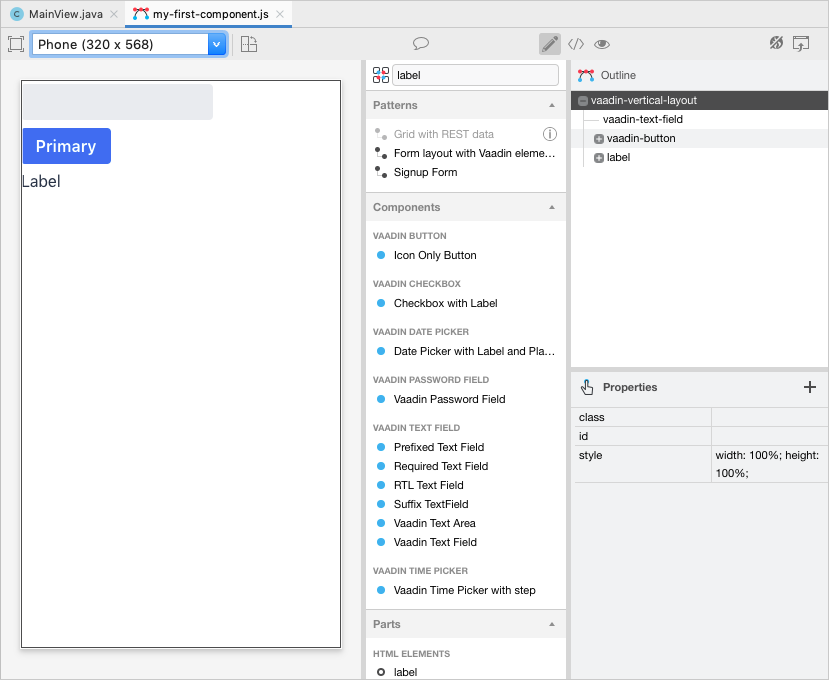
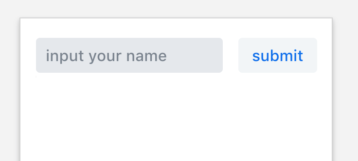

= Vaadin Designer Tutorial

:type: text
:tags: Component, CSS, Java, Templating, Web Components
:description: This article shows how to do the first steps with the Vaadin Designer to create components and views and make it easy to design your application.
:repo:
:linkattrs:
:imagesdir: ./images
:related_tutorials:

---
title: From zero to app with designer
order: 1
layout: page
---

ifndef::imgdir[:imgdir: ../img]
[[from.zero.to.app.with.designer]]
= Form zero to app with Vaadin Designer

In this tutorial, we will show how to use the Vaadin designer from the scratch of the developement, over the orchestration of views and components, individual css adjustments and the integration of the backend up to the finished application.

This is a hands-on tutorial, so you can read the explaination and join the steps right away on your machine. Let's start with the first step and download a starter project from https://vaadin.com/start and build it with `mvn install` so we will get all necessary components to our workspace. After the project has been successfully created you can import the project into your preferred IDE (IntelliJ or Eclipse).

== Installation of Vaadin Designer
Please make sure you have valid licence files installed as described in the https://vaadin.com/docs/v14/designer/getting-started/designer-licensing.html[documentation]. If that is the case, follow the neccessary steps to install the designer either in IntelliJ or Eclipse:

=== IntelliJ
1. open "Preferences" in the main menu
2. click on "Plugin" in the side menu
3. search for "Vaadin Designer" and install the plugin

=== Eclipse
1. open "Help" and "Install New Software..." in the submenu
2. add "https://vaadin.com/eclipse" as "Work with"
3. open the main item Vaadin and select "Vaadin Designer" to install it

After restart the IDE of your choise you can start using the Vaadin Designer. 

You find more information about the installation process on our https://vaadin.com/docs/v14/designer/getting-started[webpage].

== First steps with Vaadin designer

With the designer you can create your own components or arrange a whole view with several components from the Vaadin framework or your own created components.

The designer runs either integrated in your IDE or dedicated in its own browser. To activate the browser integration please follow the instructions on this https://vaadin.com/labs/designer-chrome[webpage].

Both approaches allow you to assemble your UI via drag'n'drop existing components from the side menu to a view, align and design the elements and see the results right away on the screen.

Let's get started with creating our first element. Therefor you need to do the following steps:

1. Right click on your project folder and select the "Vaadin 10+ design" item
2. enable the "Create Java companion file" option
3. select a good name for your element (I will take "my-first-component" in this example)
4. press "okay" to create the new component

[[figure.designer.tutorial.new.vaadin.design]]
.New Component created with Vaadin Designer
image::images/designer-4-new-element.png[300, 400]

When you double click on the `my-first-component.js` it should open the Vaadin Designer. In the center area you have the empty view, which can be started with different basic designs. The first window column on the right contains the component library with default Vaadin components, your custom components from the workspace and common html components. These can be dragged and dropped onto the according view and aligned as desired. The boxes on the far right contains a hierarchy view of the components and below a table to change properties of selected components.

[[figure.designer.tutorial.new.vaadin.design]]
.Vaadin Designer integrated in your IDE
image::images/designer-4-ui.png[600, 800]

After creating the component you will see in the project explorer two generated files. `MyFirstComponent` is the java class for the component and `my-first-component.js` the corresponding polymer template.

In the `MyFirstComponent` class you will find a simple generated component stub, which can be extended programmatically. The `my-first-component.js` could be found in the `frontend` folder and extends a `PolymerElement`. 

== Create a Component

We are going to start with a simple component which let the user input his name and after click a submit button, a personal greeting message will be displayed on the screen.

Let's take the `Vertical` as a base layout in the designer and drag a `Vaadin Text Field`, `Primary Button` and a `label` on the view. The elements from the component menu might have a bit different names than you known like `Primary Button`, `Icon Text Field` or `Horizontal Layout Margin`. As you can see from the name, these are pre-styled components and I think that appearance can be derived from the name. After adding all component to the view, you might already notice, all components are arranged on the upper left side. 

[[figure.designer.tutorial.new.vaadin.design]]
.all components are added to the main layout

To align the `vaadin-text-field` and the `vaadin-button` horizontally we need to add an additional `horizontal-layout` on top of the existing `vertical-layout` and add the text-field and the button to it.

[[figure.designer.tutorial.new.vaadin.design]]
.add theme as property to main layout
image::images/designer-4-change-hierarchy.gif[200, 400]

In the next step we detach the components from the edge of the main layout and bring some distance between them. Therefore I will add a `margin` theme to the main layout by selecting the `vaadin-vertical-layout` item in the "Outline" box and click on the "+" in the Properties box to add an additional item with the name "theme" and the value `marign`.

[[figure.designer.tutorial.new.vaadin.design]]
.add theme as property to main layout
image::images/designer-4-add-margin-property.png[200, 250]

In the next step we are going to change some of the component properties to adjust the styles accordingly. If you click on the `vaadin-text-field` in the "Outline" box it will open the associated component properties in the "Properties" box. Let's add a hint the text-field what the user should input here by set the value of the "placeholder" item for example to "input your name". After changing the value you will see the result right away in the designer. Next, let's set the theme of the button to "secondary" to make it less ocular and change the text of the button to "submit". Last but not least, remove the default value of the label.

[[figure.designer.tutorial.new.vaadin.design]]
.final design of the component

Now we want to add some functionality to the components to display the input value in the label with the current time. If you open the class MyFirstComponent you will find a simple stub of the component with a default constructor and an interface of the template model.

[source, java]
.Content of MyFirstComponent 
----
@Tag("my-first-component")
@JsModule("./my-first-component.js")
public class MyFirstComponent extends PolymerTemplate<MyFirstComponent.MyFirstComponentModel> {

    //Creates a new MyFirstComponent.
    public MyFirstComponent() {
        // You can initialise any data required for the connected UI components here.
    }

    ...
}
----

To create a representation of the component in the MyFirstComponent, we need to click on the icon of the component in the Outline Box.

[[figure.designer.tutorial.new.vaadin.design]]
.icon to add component representation in Java class
image::images/designer-4-create-java-representation.png[200, 250]

This will create field in the MyFirstComponent class and can be used as an UI-Object as you might known from other Vaadin implementation work.

[source, java] 
----
@Id("vaadinTextField")
private TextField vaadinTextField;
----
.Representation of component in Java class

As an example how to integrate components from a designer in your Java application and interact with the backend, let's add the value of the `text-field` to the label and add a "Hello" String as well as the current date. In `MyFirstComponent` add the following lines of code to the constructor:

[source, java] 
----
label.setText(String.format("Hello %s, it is %s", //<1>
                        vaadinTextField.getValue(), //<2>
                        LocalDate.now().toString()))); //<3>
----

<1> define a string format with placeholder for the value of the text field and the current date  
<2> value of textfield
<3> current date as text

After adding the new component you view, you will see the following view:

[[figure.designer.tutorial.new.vaadin.design]]
.component after styling
image::images/designer-4-first-styled-design.png[200, 250]

Let's summarize what we did in the first part of this article. We created a new component, define basic design, added UI Elements to it and changed the hierachy and the styling.

In the step we are going to create our own view and add our own component on it.

=== Create a View
Since Vaadin 10 each UI component can be a view, as long it has the `@Route` annotation. To create a new view we do the same steps when creating a component. Right click in the project explorer and add a new "Vaadin 10+ Design". Vaadin Designer provides basic layouts to make the view building simple and easy.

As an example we create a component with a Java companion file called "MyFirstView" and select the "Header & footer" as a basic layout. It will create a `vertical-layout` with 3 sub-layouts for the header, footer and the content in it. In the design are, the header and footer will be displayed in gray. Let's a `h1`-element to the header and change the  and a `h4`-element to the footer.

[[figure.designer.tutorial.new.vaadin.design]]
.first view after styling
image::images/designer-4-first-view.png[200, 500]

In the next step we need to open the Java companion file and add the @Route annotation above the class name.

[source, java] 
----
@Tag("my-first-view")
@JsModule("./my-first-view.js")
@Route("first-view")
public class MyFirstView extends PolymerTemplate<MyFirstView.MyFirstViewModel> {
    ...
}
----
.add Route annotation to the view class

After starting the application server you can check the result calling http://localhost:8080/first-view in your browser. Now we can add our previously created component `my-first-component` to the center layout as well as a `vaadin-grid`. As you might know, to use the full strenght of the `vaadin-grid` we need to set a type of the item we want to show in the component. In our example we want to show the name of the people and the datetime when they submit they name. Therefor we need to create a simple bean with a string for the name and a datetime for the login time as instance variables. We can do it with a small inner class inside in the `MyFirstView`looking like this:

[source, java] 
----
 private class PersonDTO {
    private String name;
    private LocalDateTime time;

    //constructor, getter, setter
 }
----
.inner class for grid component

After creating the DTO class we create a component link for the `vaadin-grid` and `my-first-component` in the view class by clicking on the icon in the outline box.

[[figure.designer.tutorial.new.vaadin.design]]
.connect component in designer in view class
image::images/designer-4-connect-component.png[200, 300]

Now we can create columns for the "name" and the "submit-time" by using the API of the grid component. The columns won't be visible in the design view, because their got initialized during runtime and the corresponoding design show the uninitilazed component. In the second part of this article we show more details about how to create a Listing component with the designer. 

To show the results of the input in the `vaadin-grid` we will create a consumer in the `my-first-component` and add a code block to it which will be applied after clicking the submit button. All added items will be kept in a set.

[source, java] 
----
public class MyFirstView extends PolymerTemplate<MyFirstView.MyFirstViewModel> {
    
    //Component definitions
    ...

    private List<PersonDTO> personDTOSet = new ArrayList<>();

    public MyFirstView() {

        //add columns for "name" and "submit time" to grid
        vaadinGrid.addColumn(PersonDTO::getName).setHeader("Name");
        vaadinGrid.addColumn(PersonDTO::getSubmitTime).setHeader("Submit Time");

        //set code block which is applied after button click
        myFirstComponent.setPersonDTOConsumer(personDTO -> {
            personDTOSet.add(personDTO);
            vaadinGrid.getDataProvider().refreshAll();
        });
        vaadinGrid.setItems(personDTOSet);
    }

    public interface MyFirstViewModel extends TemplateModel { ... }

    public static class PersonDTO { ... }
}
----
.add columns to grid and set consumer to component

In the `my-first-component` we define a field for the consumer and an appropriate set-methode. Inside the submit button click handler we need to accept the value in the consumer.

[source, java] 
----
vaadinButton.addClickListener(buttonClickEvent -> {
            ...
            if (personDTOConsumer != null) {
                personDTOConsumer.accept(personDTO);
            }
        });
----
.accept the value in the consumer to add it the grid
